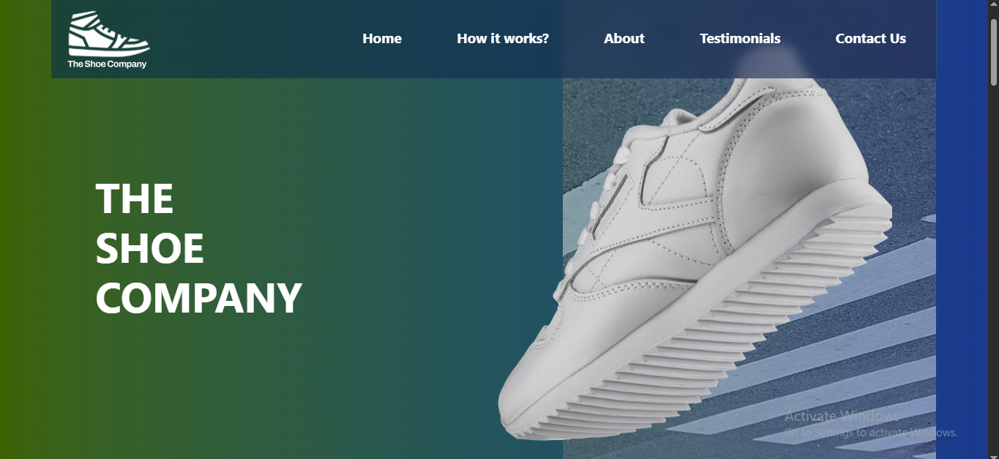
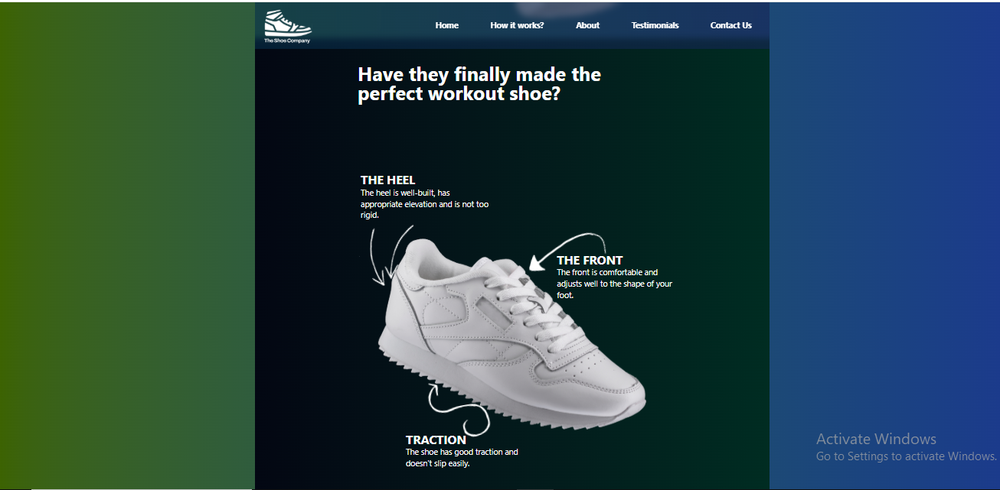
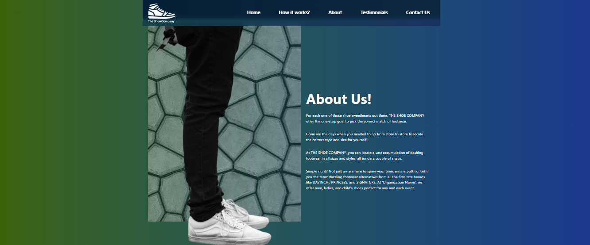
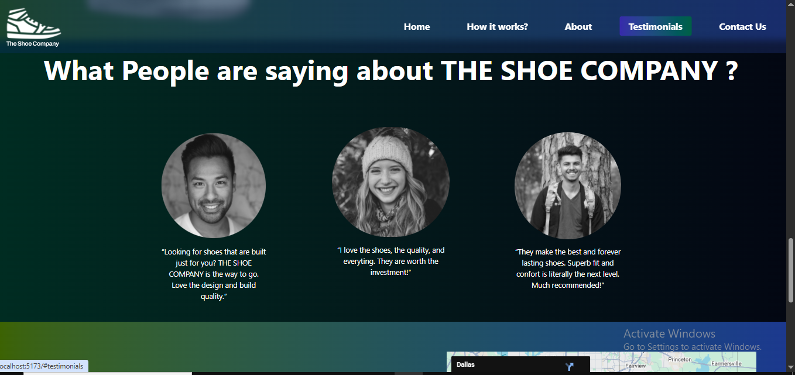
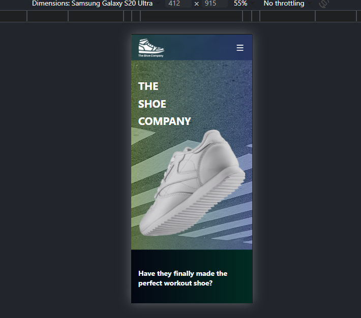
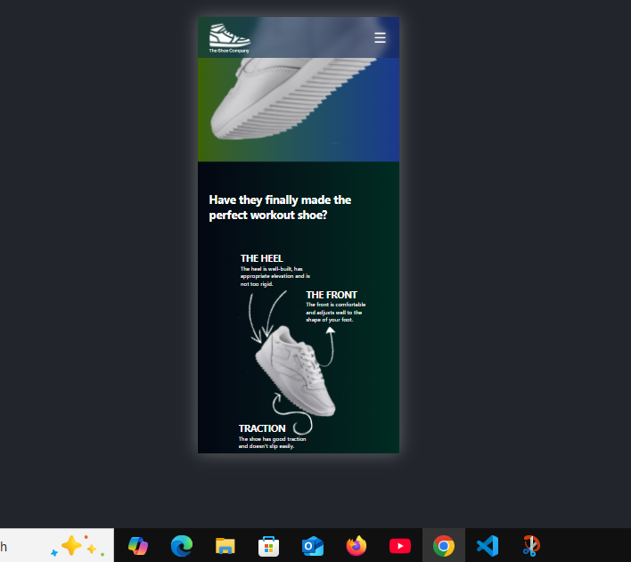
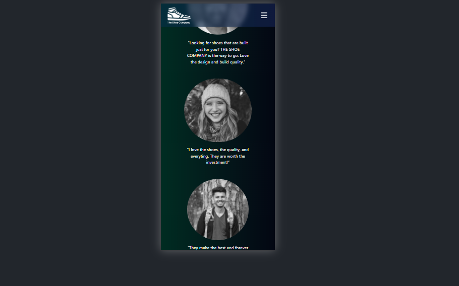

# 👟 StrideZone - The Shoe Company

StrideZone is a modern, responsive, and stylish Shoe Company Website built with React + Vite + Tailwind CSS.
It highlights products, brand story, and ensures a smooth user experience across all devices.

🔗 **Live Demo:** [StrideZone](https://stridezone.netlify.app)

## 🎨 Figma Design Reference

- The UI/UX design for this project is based on a Figma design:  
  [View the Figma Design](https://www.figma.com/design/KRagV1oBRnzQAOIOwalUgz/The-Shoe-Company?node-id=0-1&p=f)

**Note:** The layout and structure follow the Figma design closely, but colors, hover effects, and active background states have been customized in this implementation.

## ✨ Features

⚡ Blazing Fast – Powered by Vite

🎨 Modern UI/UX – Tailwind CSS for clean and responsive design

📱 Fully Responsive – Mobile-first approach, works on all devices

🧩 Reusable Components – Scalable modular React structure

🚀 Interactive Modal – Built using React Portal for seamless user experience

🌙 Clean Codebase – ESLint & Prettier integrated for consistency

🚀 Performance Optimized – Lazy loading & code-splitting implemented for faster load times.  
All images are also lazy-loaded for better performance.

## 🚀 One-Click Deploy – Hosted on Netlify

## 🛠️ Tech Stack

- React – For building UI components

- Vite – Fast bundler & development server

- Tailwind CSS – Utility-first CSS framework

- ESLint – Code linting & error checking

## Prettier – Code formatting

## 📂 Folder Structure

StrideZone/
├── public/ # Static files
├── src/
│ ├── assets/ # Images, icons, static assets
│ ├── components/ # Reusable UI components
│ ├── hooks/ # Custom React hooks
│ ├── App.jsx # Root React component
│ ├── main.jsx # React entry point
│ ├── index.css # Global styles (Tailwind)
│ └── App.css # Additional styles
├── .eslintrc.js # ESLint configuration
├── .prettierrc.json # Prettier configuration
├── package.json # Dependencies & scripts
├── vite.config.js # Vite configuration
├── tailwind.config.js # Tailwind configuration
├── index.html # Main HTML file
└── README.md # Project documentation

---

## ⚙️ Getting Started

Clone and run the project locally:

```bash
# Clone the repository
git clone https://github.com/Magan248/StrideZone.git
cd StrideZone

# Install dependencies
npm install

# Start development server
npm run dev

# Build for production
npm run build

# Preview production build
npm run preview
```

## 📸 Screenshots

### 🖥️ Desktop View

- **Home Page**
  

- **About Section**
  

- **Product About**
  

- **Testimonials Section**
  

---

### 📱 Mobile View

- **Home Page (Mobile)**
  

- **Mobile Home with How it work Section**
  
- **Mobile Testimonials Section**
  

  🧹 Code Quality

#### This project follows industry best practices:

✅ Linting with ESLint (npm run lint)

🔧 Auto-fix common issues (npm run lint:fix)

🎯 Prettier for consistent code formatting

## 👨‍💻 Author

**Magan Singh**

- GitHub: [@Magan248](https://github.com/Magan248)
- LinkedIn: [Magan Singh](https://www.linkedin.com/in/magan248)
- Live Demo: [StrideZone](https://stridezone.netlify.app/?utm_source=newsletter&utm_medium=email)
